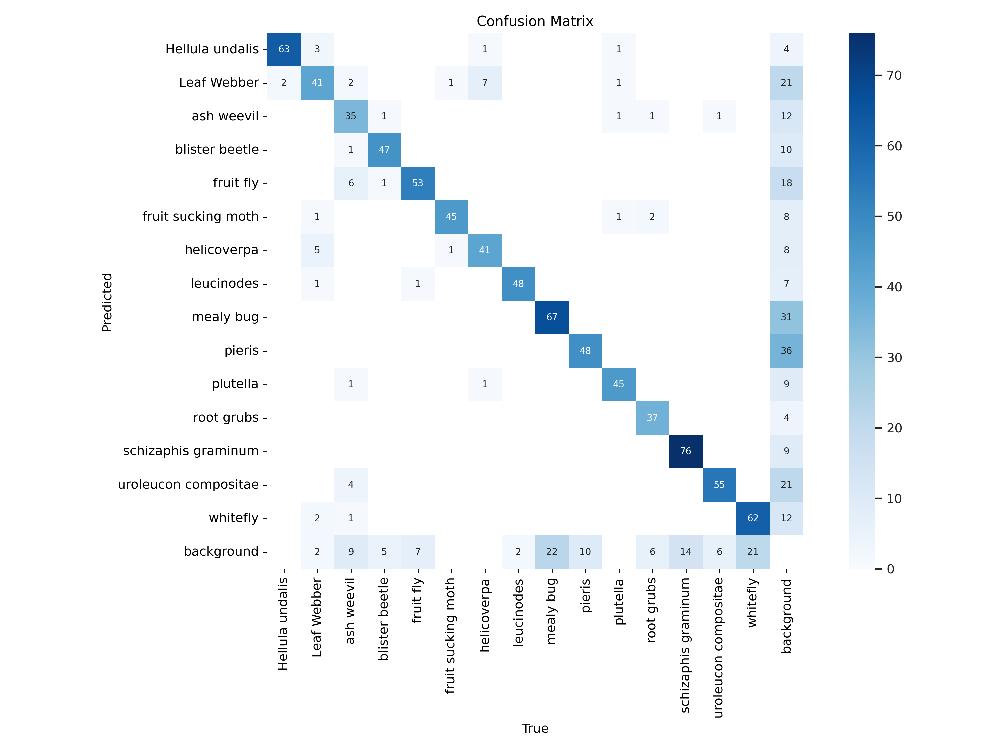
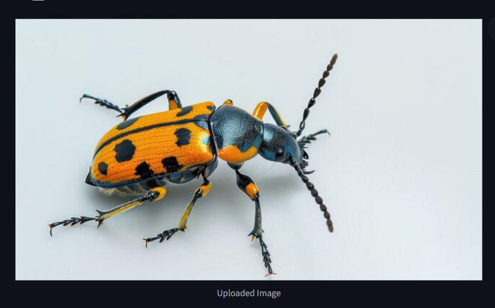
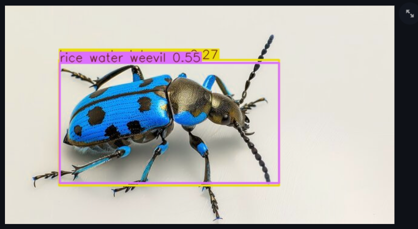

# 🐛 Pest Detection with YOLOv8

This project implements a real-time pest detection system using the YOLOv8 object detection model. It identifies various agricultural pests from images and videos. The dataset is sourced from Roboflow, and a Streamlit web app is used for deployment and testing.

## 📁 Project Structure
```bash
YOLOv8_Pest_Detection_Project/
├── split_data/ # Scripts or folders used to split dataset into train/val/test
├── .gitignore # Git ignore rules
├── README.md # Project documentation
├── Requirements.txt # Python dependencies
├── best.pt # Trained YOLOv8 model weights
├── data.yaml # YOLOv8 data configuration file
└── main.py # Streamlit app
```


---

## 🚀 How to Run

### 1. Clone the Repository
```bash
git clone https://github.com/yourusername/YOLOv8_Pest_Detection_Project.git
cd YOLOv8_Pest_Detection_Project

pip install -r Requirements.txt

python main.py

```

## 🧠 Model Details
Model: YOLOv8

Framework: Ultralytics YOLO

Weights File: best.pt

Config File: data.yaml

## Outputs

<p align="center">
  
</p>

<p align="center">
  
</p>

<p align="center">
  
</p>


# 🧑‍💻 Author
### omkar614 
